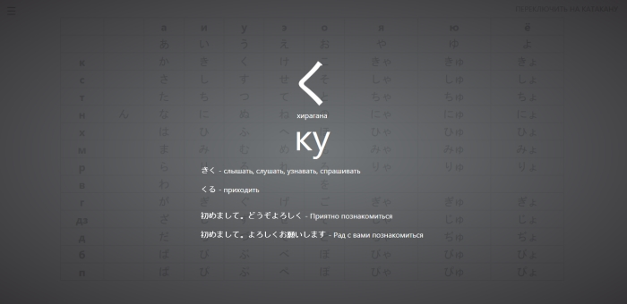
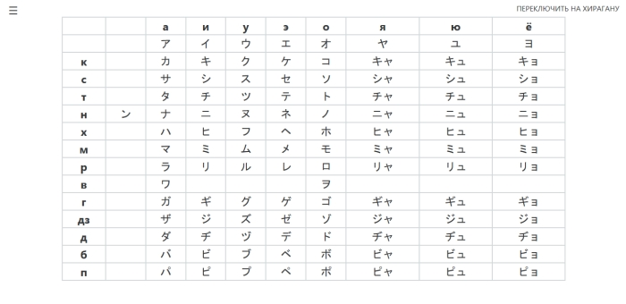
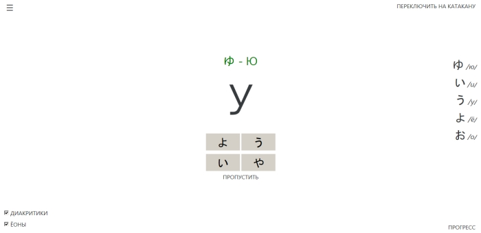
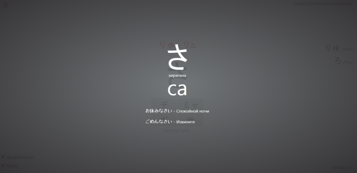
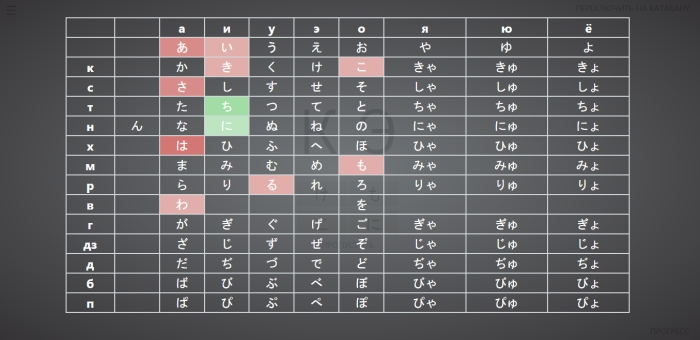

## マルシャ  — веб-приложение для изучения японских азбук хираганы и катаканы

### Ссылки на приложение

* [На GitHub Pages](https://become-iron.github.io/marusha) (рекомендуется)
* [Вконтакте](https://vk.com/app5772184)

### Название приложения
マルシャ — Marusha, Маруся :cat:

```
∧＿∧
( ･ω･｡)つ━☆・*。
⊂　 ノ 　　　・゜+.
しーＪ　　　°。+ *´¨)
　　　　　　　　　.· ´¸.·*´¨) ¸.·*¨)
　　　　　　　　　　(¸.·´ (¸.·'* マルシャ
```

**Приложение создано с целью собрать лучшие фичи других приложений для изучения японских азбук.**

### Особенности приложения

* Прогресс, набранный в ходе тренировок, сохраняется (в [localStorage](https://en.wikipedia.org/wiki/Web_storage)). Настройки тренировок также сохраняются. Есть возможность сброса сохранённых данных
* «Карточки» слогов азбук. Содержат некоторые слова и фразы с использованием выбранного символа
* Таблицы прогресса для каждой тренировки с подсветкой слогов. Для каждой азбуки — отдельный прогресс
* Возможность отключения в тренировках диакритиков ([дакутэнов](https://ru.wikipedia.org/wiki/Дакутэн) и [хандакутэнов](https://ru.wikipedia.org/wiki/Хандакутэн)) и [ёонов](https://ru.wikipedia.org/wiki/Ёон) в предлагаемых символах
* Тренировка «Знак в транскрипцию». Написать транскрипцию предлагаемого слога
* Тренировка «Транскрипцию в знак». Для транскрипции выбрать верный символ каны
* Тренировка «Соответствующий символ». Выбрать для слога хираганы соответствующий символ катаканы — и наоборот
* Тренировка «Похожие символы». Аналогична тренировке «Транскрипцию в знак», но среди предложенных ответов будут только символы трудные для запоминания

### Источники "вдохновения":

* [Тренажёр для заучивания хираганы/катаканы](http://saison-group.ru/study/hiragana)
* [hiragana.training](http://hiragana.training)
* [Android-приложение "Hiragana - Learn Japanese"](https://play.google.com/store/apps/details?id=com.legendarya.helloandroid)
* [Android-приложение "JVocab - Японский язык"](https://play.google.com/store/apps/details?id=com.mannaka.jvocab)

### Дополнительно

[TODO-файл](/TODO.md)

#### Технические детали

Приложение написано с использованием Angular-CLI (Angular 2, TypeScript 2, Webpack)

### Скриншоты











